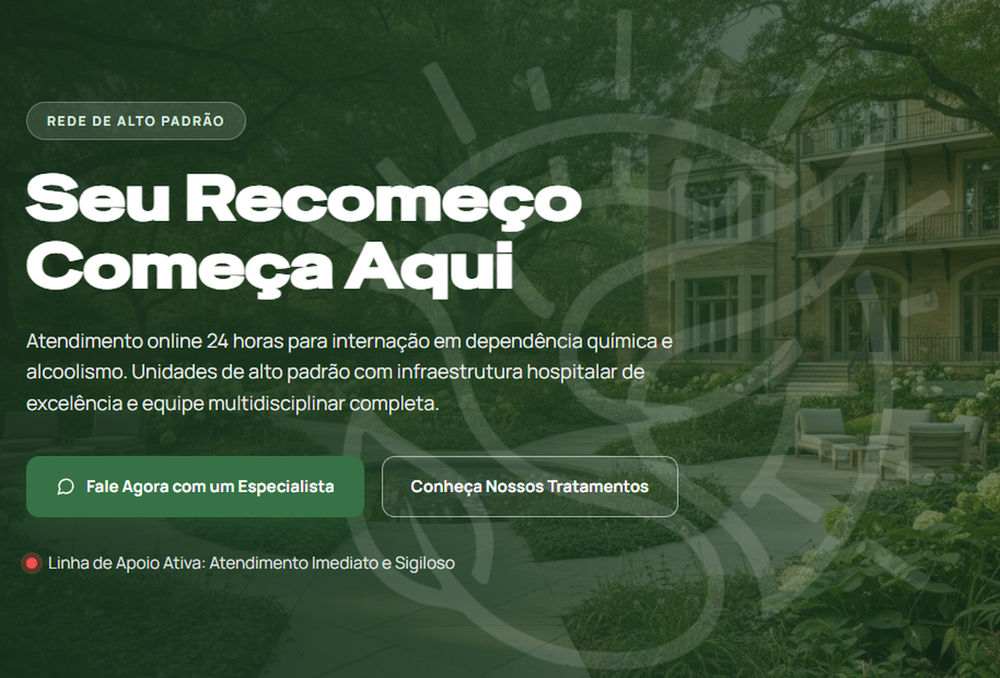

<h1 align="center"> Recomeço à Vitória 🏥</h1>

Site institucional da Clínica Recomeço à Vitória.

  <a href="#-tecnologias">Tecnologias</a>&nbsp;&nbsp;&nbsp;|&nbsp;&nbsp;&nbsp;
  <a href="#-projeto">Projeto</a>

  
 

## 🚀 Tecnologias

Esse projeto foi desenvolvido com as seguintes tecnologias:

- HTML
- CSS
- JavaScript
- Figma
- Git e Github

## 💻 Projeto

- Site institucional da Clínica Recomeço à Vitória, desenvolvido a partir do design criado no Figma.

- Página construída com HTML, CSS e JavaScript, com foco em uma apresentação clara da clínica e em facilitar o contato dos visitantes.

<h2 align="center">📌 Desenvolvedores</h2>

<table align="center">
  <tr>
    <td align="center">
      <a href="https://github.com/rebellatoGui" title="GitHub">
         
        
          <b>Guilherme Rebellato</b>
        
      </a>
    </td>
  </tr>
</table>

 

---

Feito com ♥ por rebellatoGui

